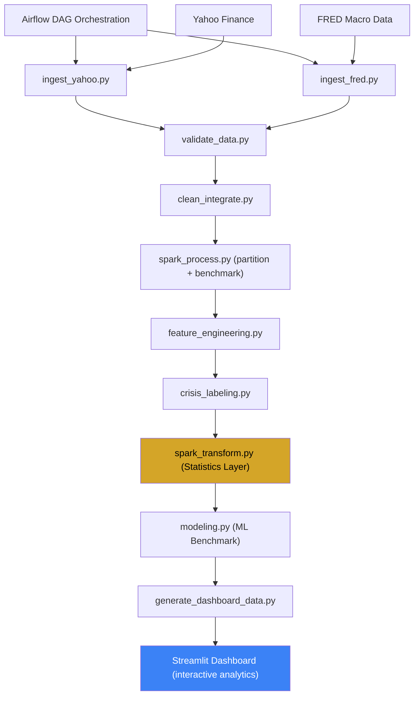

# 🥇 Gold Safe Haven Analytics — Big Data Platform

<p align="center">
  
  
  
  
  
</p>

**End-to-end Apache Airflow + PySpark + Machine Learning project.**  
โปรเจกต์งานวิจัยเชิงข้อมูลขนาดใหญ่ (Big Data) เพื่อตอบคำถามทางการเงินระดับมหภาค: **"ทองคำเป็นสินทรัพย์ปลอดภัย (Safe Haven) จริงหรือไม่ ในยามวิกฤตเศรษฐกิจ?"** 

ระบบถูกออกแบบด้วยสถาปัตยกรรม **Data Engineering** เต็มรูปแบบ ตั้งแต่การดึงข้อมูล (Ingestion) จาก API การประมวลผลข้อมูลขนาดใหญ่ (Spark) เลเบลข้อมูลเศรษฐกิจถดถอย การสร้างโมเดล Machine Learning Benchmark ไปจนถึงการนำเสนอผ่าน **Streamlit Dashboard ระดับพรีเมียม**

---

## 🧭 Architecture




---

## 🚀 1. What This Project Does (กระบวนการทำงานแบบละเอียด)

โปรเจกต์นี้ทำงานครอบคลุม 6 ขั้นตอนหลักแบบอัตโนมัติ (End-to-End Pipeline):

1. **ดึงข้อมูลดิบ (Data Ingestion):** 
   ระบบดึงตัวเลขย้อนหลัง 30 ปีจาก 2 แหล่งหลัก ได้แก่ **Yahoo Finance API** (ราคาสินทรัพย์ 35 ชนิด ครอบคลุมทั้งทองคำ หุ้น คริปโต พันธบัตร) และ **FRED API** (ข้อมูลความกลัว VIX และประกาศเศรษฐกิจถดถอย NBER)
2. **แก้ปัญหาและรวมข้อมูล (Data Integration & Cleaning):** 
   เนื่องจากวันหยุดของหุ้นและคริปโตเทรดไม่ตรงกัน ระบบจึงใช้ `Pandas` ทำกระบวนการ **Forward-fill** (ดึงตัวเลขล่าสุดไปเติมใส่วันที่ขาดหาย) และเชื่อมข้อมูลทั้งหมดเข้าด้วยกัน (Merge Join) เป็นฐานข้อมูลเดียวที่สมบูรณ์
3. **จัดการข้อมูลขนาดใหญ่ (Big Data Transformation):** 
   เมื่อได้ฐานข้อมูลดิบขนาดหลายแสนตาราง ระบบจะใช้ **Apache Spark (PySpark)** เพื่อแปลงผลลัพธ์จากไฟล์ CSV ธรรมดาให้เปิดเป็นรูปแบบ **Parquet** และซอยแบ่งโฟลเดอร์ตามประเภทสินทรัพย์ (Partitioning) ทำให้สามารถดึงข้อมูลมาคำนวณกราฟได้อย่างรวดเร็ว
4. **ระบุจุดวิกฤต (Crisis Labeling & Feature Engineering):** 
   ระบบจะทำการคำนวณ % ขาดทุนสะสม (Drawdown) และนิยามคำว่า **"วิกฤต"** ด้วยเงื่อนไข VIX, recession และ SPY drawdown ก่อนแปะป้าย (Label) ให้วันที่เข้าข่ายเป็น Crisis Day
5. **วิเคราะห์ด้วย Machine Learning:** 
   ระบบจะป้อนข้อมูลเฉพาะ 'วันที่เกิดวิกฤต' เข้าสู่โมเดล **Random Forest** และ **Gradient Boosting** (โดยป้องกัน Data leakage ด้วย TimeSeriesSplit) เพื่อหาคำตอบว่า ปัจจัยเศรษฐกิจตัวไหนที่ส่งผลให้ทองคำรอดพ้นจากสภาวะตลาดพังได้มากที่สุด
6. **สร้าง Web Dashboard อัจฉริยะ:** 
   ส่งต่อข้อมูลที่คำนวณไปแสดงผลบนเว็บแอปพลิเคชันแบบ Interactive พร้อมระบบ **Portfolio Simulator** ให้นักลงทุนได้ทดสอบสมมติฐาน

---

## 🏗️ 2. Project Structure (โครงสร้างโปรเจกต์)

```text
gold-safe-haven-bigdata/
|-- dags/
|   `-- gold_safe_haven_dag.py        # โค้ดสำหรับรันบนเว็บ Airflow
|-- src/
|   |-- config.py                     # ตั้งค่า 35 สินทรัพย์และนิยามวิกฤต
|   |-- ingest_yahoo.py               # ดึงข้อมูลจาก Yahoo
|   |-- ingest_fred.py                # ดึงข้อมูลจาก FRED
|   |-- validate_data.py              # ตรวจสอบคุณภาพข้อมูล (QC)
|   |-- clean_integrate.py            # เติมจุดแหว่งและ Merge ข้อมูล
|   |-- spark_process.py              # ประมวลผล Big Data และทำ Parquet
|   |-- feature_engineering.py        # คำนวณความเสี่ยง/Drawdown
|   |-- crisis_labeling.py            # แปะป้ายวันที่เป็นวิกฤต
|   |-- spark_transform.py            # PySpark statistics + Safe Haven Score
|   |-- modeling.py                   # รัน Machine Learning
|   `-- generate_dashboard_data.py    # บีบอัดข้อมูลส่งขึ้นเว็บ
|-- app/
|   `-- dashboard.py                  # หน้า UI Web Dashboard
|-- data/
|   |-- raw/                          # เก็บไฟล์ .csv ดิบ
|   |-- integrated/
|   |-- parquet/                      # เก็บฐานข้อมูล Big Data แบบ Parquet
|   `-- dashboard/                    # processed/dashboard-ready data
|-- docs/                             # rubric, presentation, oral Q&A
|-- reports/                          # quality report, benchmark, ML results
|-- docker-compose.yml                # ไฟล์จำลองเซิร์ฟเวอร์ Airflow
|-- HOW_TO_RUN.md                     # คู่มือรันแบบ step-by-step
|-- run_pipeline.py                   # สคริปต์คลิกรันทีเดียวจบ
`-- README.md
```

---

## ⚙️ 3. Airflow DAGs (ระบบอัตโนมัติ)

โปรเจกต์นี้มีโฟลเดอร์สำหรับทำ **Apache Airflow** 
- **DAG Name:** `gold_safe_haven_pipeline`
- **Purpose:** ทำหน้าที่เป็นผู้ควบคุมสั่งรันโค้ด Python ในโฟลเดอร์ `src/` ไล่ทีละสเต็ปตามลำดับอย่างเป็นระเบียบ หากขั้นตอนไหนดึง API พลาด Airflow จะแจ้งเตือน Error ระบุจุดแตกหักได้ทันที

---

## 📊 4. Web Dashboard Features

เว็บไซต์วิเคราะห์ถูกเขียนขึ้นด้วย **Streamlit** (ใช้ธีม Premium Dark Mode) ประกอบด้วยฟีเจอร์หลัก เช่น:

ทุกหน้าวิเคราะห์หลักใช้ **Global Controls** ใน Sidebar ร่วมกัน ได้แก่ Preset Period, Custom Date Range, Rolling Window 30/90/180 วัน และ Asset Selector แบบหลายตัวเลือก เพื่อให้ผู้ใช้ทดสอบได้ว่าผลลัพธ์เปลี่ยนตาม regime และช่วงเวลาหรือไม่ ไม่สรุปจาก full-period average เพียงชุดเดียว

1. **ภาพรวม (Overview):** เช็คจำนวนข้อมูล (200k+ จุด) ย้อนหลัง 30 ปี
2. **วิเคราะห์วิกฤต (Crisis Analysis):** เปรียบเทียบผลตอบแทนช่วงตลาดพัง vs ตลาดปกติ
3. **เจาะลึกวิกฤต (Crisis Deep-Dive):** เลือกเหตุการณ์วิกฤตประวัติศาสตร์ (เช่น Dot-com, 2008) ดูกราฟแบบเจาะจง
4. **จำลองพอร์ต (Portfolio Simulator):** ลาก Slider จัดพอร์ตผสมทองคำเทียบกับถือหุ้น 100% ว่าลดเปอร์เซ็นต์ขาดทุน (Drawdown) ได้จริงไหม
5. **ความสัมพันธ์ (Rolling Correlation):** กราฟความสัมพันธ์ของทองกับความเสี่ยงแบบขยับหน้าต่างเวลา
6. **ความเสี่ยง (Risk & Volatility):** Scatter Plot หาตัวแปรที่ผันผวนน้อยที่สุด
7. **อันดับ Safe Haven:** การจัด Ranking หาสินทรัพย์ที่ดีที่สุดยามวิกฤต
8. **Machine Learning:** เปรียบเทียบโมเดล และดู Feature Importance
9. **สรุปเชิงลึก (Insights):** Card สรุปผลลัพธ์ทั้งหมดอัตโนมัติ

---

## 🛠️ 5. วิธีการรันโปรเจกต์ (How to Run)

### วิธีที่ 1: การรัน Pipeline สกัดข้อมูล และเปิด Web Dashboard (Local Run)
```bash
# 1. ติดตั้งไลบรารี
pip install -r requirements.txt

# 2. รันสกัดและทำความสะอาดข้อมูล (ใช้เวลาประมวลผล 1-3 นาที)
python run_pipeline.py

# 3. รันหน้า Web Dashboard
python -m streamlit run app/dashboard.py
```
*(แอปจะเด้งเปิดขึ้นมาที่ลิ้งก์ `http://localhost:8501` อัตโนมัติ)*

> ถ้า Yahoo/FRED โหลดไม่ได้ แต่มี raw CSV เดิม ระบบจะใช้ cached data ต่อและ log เป็น `USING_CACHED`

### สิ่งที่ Dashboard/ML ใช้จริง
- Dashboard อ่านเฉพาะ `data/dashboard/` ไม่อ่าน raw data โดยตรง
- `analysis_panel.parquet` = processed panel สำหรับ Time Filter / Asset Filter ใน Streamlit
- `return_ranking.csv` = จัดอันดับจาก mean crisis return เท่านั้น
- `safe_haven_ranking.csv` = จัดอันดับจาก composite Safe Haven Score 6 มิติ
- ML ใช้ `sklearn Pipeline`: `SimpleImputer → StandardScaler → Model`
- ML ใช้ lag-1 features + `TimeSeriesSplit` เพื่อลด look-ahead bias

### วิธีที่ 2: การเปิดระบบ Apache Airflow (Docker required)
หากต้องการพรีเซนต์ผังระบบอัตโนมัติ ให้ใช้ Docker พิมพ์คำสั่งนี้ใน Terminal:
```bash
docker compose up -d
```
1. เปิด Browser ไปที่ `http://localhost:8080`
2. Username: `admin` | Password: `admin` (local demo account from `docker-compose.yml`)
3. คุณจะเห็นกราฟหน้าต่าง DAG สั่งรันงานครบ Loop ได้จากบนเว็บทันที

---

## 📁 6. Output Locations (พิกัดผลลัพธ์)

- ไฟล์ข้อมูลดิบทั้งหมด: `data/raw/`
- ไฟล์ระดับ Big Data แบบ Parquet/partition: `data/parquet/asset_prices/`
- ข้อมูลสรุปบนแดชบอร์ด: `data/dashboard/`
- ข้อมูลตารางการทำนาย Machine Learning: `reports/model_results.csv`

---

## 🎓 7. Project Insights (ข้อสรุปสำหรับพรีเซนต์)
- **ทองคำไม่ใช่ Safe Haven เสมอไป:** ผลจากข้อมูลขนาดใหญ่ยืนยันว่า ทองคำเป็น **"Conditional Safe Haven (ปลอดภัยแบบมีเงื่อนไข)"**
- **รอดจากเศรษฐกิจถดถอย:** ในช่วงที่มีประกาศ NBER Recession (เศรษฐกิจถดถอยรุนแรง) ทองและพันธบัตรรัฐบาล (TLT) ดึงกราฟพอร์ตให้กลับมาเป็นบวกได้ชัดเจน
- **ลดการวูบของพอร์ต:** ผ่านระบบ Portfolio Simulator พิสูจน์หลักการทางคณิตศาสตร์ได้ว่า การผสมทองคำในพอร์ตลงทุน ควบคู่กับ S&P 500 ช่วยลด Maximum Drawdown ได้อย่างมีนัยสำคัญกว่าการถือหุ้นเทคโนโลยีหรือ S&P เพียวๆ

---

## 🤖 9. ภาคผนวก: ตัวอย่างคำถามที่ใช้ร่วมกับ AI ในการพัฒนาโครงงาน

ในโครงงานนี้ ผู้จัดทำใช้ AI ในฐานะ “ผู้ช่วยวิเคราะห์และออกแบบระบบ” ไม่ใช่เพียงเครื่องมือสร้างโค้ดอัตโนมัติ โดย AI ถูกใช้เพื่อช่วยคิดเชิงโครงสร้าง ตรวจสอบความสมเหตุสมผลของ pipeline ช่วยออกแบบ dashboard และช่วยตั้งคำถามเชิงวิเคราะห์เกี่ยวกับ Safe Haven ของทองคำ

ตัวอย่างคำถามสำคัญที่ใช้ร่วมกับ AI มีดังนี้

###  คำถามด้านการกำหนดโจทย์วิจัย
- ทองคำสามารถถือเป็นสินทรัพย์ปลอดภัย (Safe Haven) ได้จริงหรือไม่ เมื่อเทียบกับหุ้น พันธบัตร ดอลลาร์ และคริปโตในช่วงวิกฤตเศรษฐกิจ
- หากต้องการวิเคราะห์ Gold Safe Haven ให้ลึกกว่าการดู correlation ทั่วไป ควรตั้งคำถามวิจัยในลักษณะใด
- จะออกแบบโครงงานอย่างไรให้ตอบคำถามเชิงพฤติกรรมของตลาด (WHY) ไม่ใช่เพียงสรุปว่าทองขึ้นหรือลง

###  คำถามด้านข้อมูลและแหล่งข้อมูล
- ควรใช้ข้อมูลจากแหล่งใดบ้างเพื่อให้ครอบคลุมทั้งราคาสินทรัพย์และตัวแปรเศรษฐกิจมหภาค
- หากต้องการข้อมูลย้อนหลัง 20–30 ปี ควรเลือกสินทรัพย์ใดมาเปรียบเทียบบ้าง
- การใช้ Yahoo Finance และ FRED ร่วมกันมีข้อดีอย่างไรในบริบทของงาน Big Data
- หากข้อมูลบางตัวเป็นรายวัน แต่บางตัวเป็นรายเดือน ควรรวมข้อมูลอย่างไรให้เหมาะสม

###  คำถามด้าน Data Pipeline และ Big Data
- หากต้องการออกแบบโครงงานให้เป็น Big Data Pipeline ครบวงจร ควรมีลำดับขั้นตอนใดบ้างตั้งแต่ ingestion จนถึง dashboard
- ทำไมจึงควรแปลงข้อมูลจาก CSV เป็น Parquet และ Parquet เหมาะกับงานลักษณะนี้อย่างไร
- Spark ควรมีบทบาทในส่วนใด และแตกต่างจาก Pandas อย่างไร
- Airflow ควรถูกใช้ในฐานะ orchestration layer อย่างไร และเหตุใดจึงไม่ถือเป็น compute engine หลัก
- หากอาจารย์ถามว่าโครงงานนี้มี transformation layer หรือไม่ ควรอธิบายโครงสร้างอย่างไรให้ชัดเจน

###  คำถามด้าน Feature Engineering และ Crisis Labeling
- หากต้องการศึกษาว่าทองเป็น safe haven หรือไม่ ควรสร้างตัวแปรใดบ้าง เช่น daily return, volatility, drawdown และ rolling correlation
- ควรนิยามคำว่า Crisis และ Normal อย่างไรให้มีเหตุผลทางการเงิน
- การใช้ VIX, recession indicator, market drawdown หรือ named crisis events มีข้อดีข้อเสียแตกต่างกันอย่างไร
- หากต้องการดูว่าทอง “ล้มเหลว” ในบางวิกฤต ควรสร้างเกณฑ์วัดอย่างไร

###  คำถามด้าน Dashboard และการสื่อสารข้อมูล
- Dashboard ควรมีหน้าใดบ้างเพื่อให้เล่าเรื่องตั้งแต่ภาพรวมจนถึงข้อสรุปสุดท้ายได้ครบถ้วน
- ควรแยก Return Ranking ออกจาก Safe Haven Leaderboard หรือไม่ และเพราะเหตุใด
- Market Breadth มีความหมายอย่างไร และช่วยตอบคำถามวิจัยของโครงงานนี้ได้อย่างไร
- หน้าสรุป Bottom Line ควรนำเสนอในรูปแบบใดจึงจะเข้าใจง่ายสำหรับผู้ฟัง
- หากต้องการให้ผู้ใช้เลือกช่วงเวลา เลือกสินทรัพย์ และดูผลลัพธ์แบบ interactive ควรออกแบบ global controls อย่างไร

###  คำถามด้าน Machine Learning
- หากต้องการทำนายว่าทองจะทำหน้าที่เป็น safe haven หรือไม่ ควรตั้งโจทย์แบบ classification หรือ regression
- เหตุใดงานข้อมูลการเงินจึงไม่ควรใช้ K-Fold แบบสุ่มทั่วไป และควรใช้ TimeSeriesSplit แทนในกรณีใด
- จะป้องกัน data leakage ในงาน machine learning ที่ใช้ข้อมูลอนุกรมเวลาได้อย่างไร
- ควรใช้ metrics ใดบ้างในการเปรียบเทียบโมเดล เช่น Accuracy, Precision, Recall, F1-score และ ROC AUC
- หากคะแนนโมเดลไม่สูงมาก ควรตีความอย่างไรให้เหมาะสมกับธรรมชาติของข้อมูลการเงิน
- Feature Importance สามารถช่วยอธิบาย “ปัจจัยที่ทำให้ทองเป็น safe haven” ได้อย่างไร

###  คำถามด้านการตีความผลลัพธ์
- หากสินทรัพย์บางตัวให้ผลตอบแทนสูงในช่วงวิกฤต แต่มี drawdown สูงมาก จะยังถือว่าเป็น safe haven ได้หรือไม่
- เหตุใด Mean Crisis Return สูง จึงไม่เพียงพอที่จะสรุปว่าสินทรัพย์นั้นเป็น safe haven ที่ดีที่สุด
- หากผลลัพธ์พบว่าทองทำงานได้ดีในบางวิกฤต แต่ไม่โดดเด่นในบางช่วง ควรสรุปว่าอย่างไร
- คำว่า “Conditional Safe Haven” มีความหมายอย่างไร และเหมาะสมกับข้อค้นพบของโครงงานนี้อย่างไร
- ปัจจัยมหภาคใดบ้างที่อาจอธิบายได้ว่าทองทำงานดีหรือทำงานล้มเหลวในแต่ละวิกฤต


###  บทบาทของ AI ในโครงงานนี้
AI ถูกใช้เพื่อช่วยใน 4 ด้านหลัก ได้แก่
1. ช่วยออกแบบโครงสร้าง Data Pipeline และ Dashboard Architecture  
2. ช่วยตั้งคำถามเชิงวิเคราะห์เกี่ยวกับ Safe Haven ของทองคำ  
3. ช่วยตรวจสอบความสมเหตุสมผลของ Machine Learning และการป้องกัน Data Leakage  
4. ช่วยปรับการสื่อสารผลลัพธ์ให้อยู่ในรูปแบบที่เหมาะกับรายงานและการพรีเซนต์

> หมายเหตุ: AI ถูกใช้เป็น “ผู้ช่วยในการคิด วิเคราะห์ และออกแบบ” โดยผู้จัดทำยังเป็นผู้ตัดสินใจเลือกแนวทาง ปรับแก้โค้ด ตรวจสอบผลลัพธ์ และสรุปข้อค้นพบสุดท้ายด้วยตนเอง

### จัดทำโดย นาย พิสิษฐ์ แซ่เตีย รหัสนักศึกษา 6704800038
